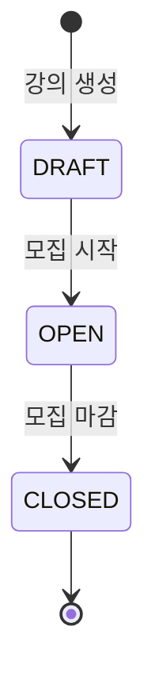
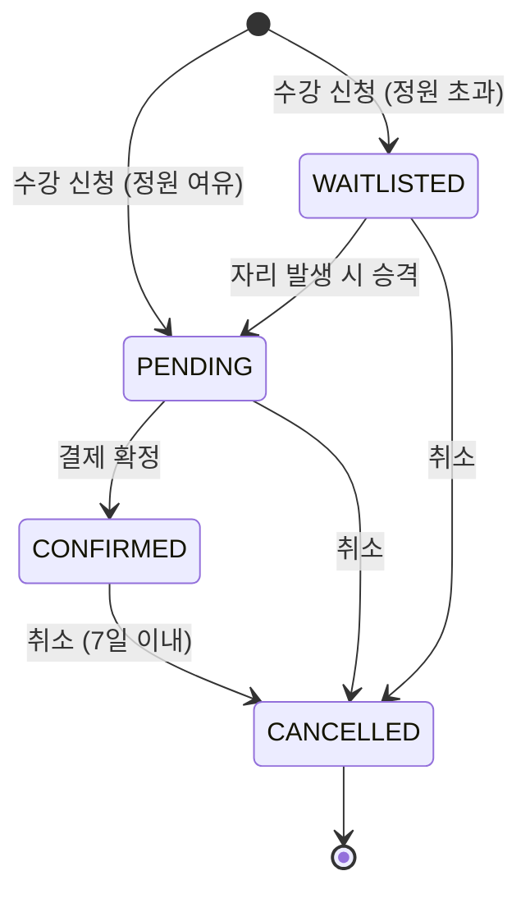
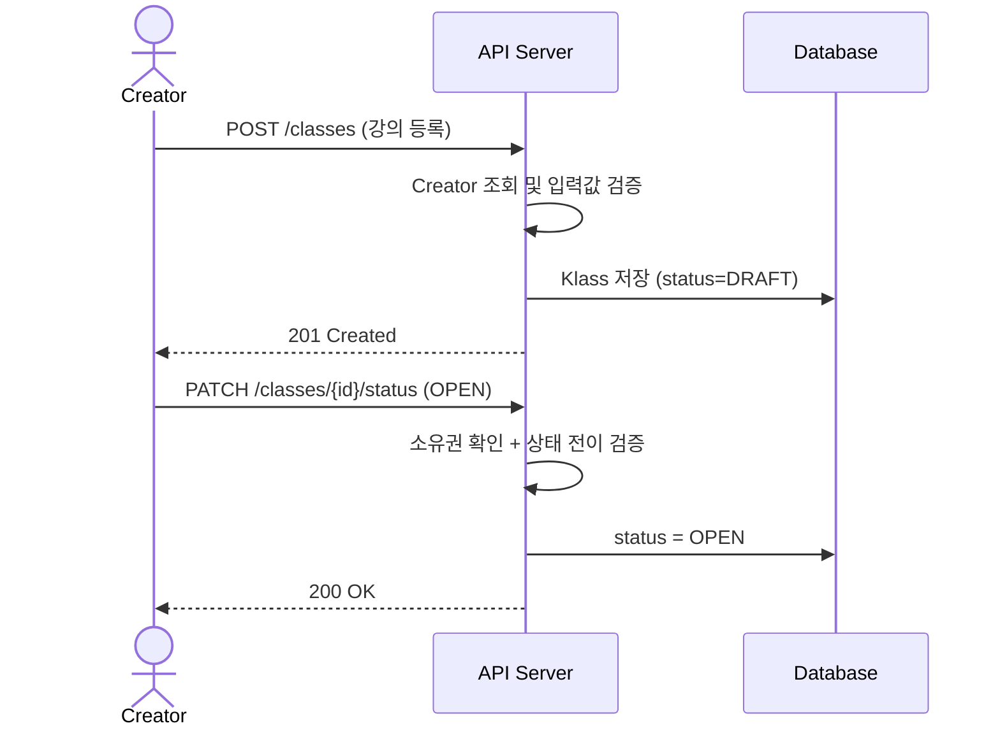
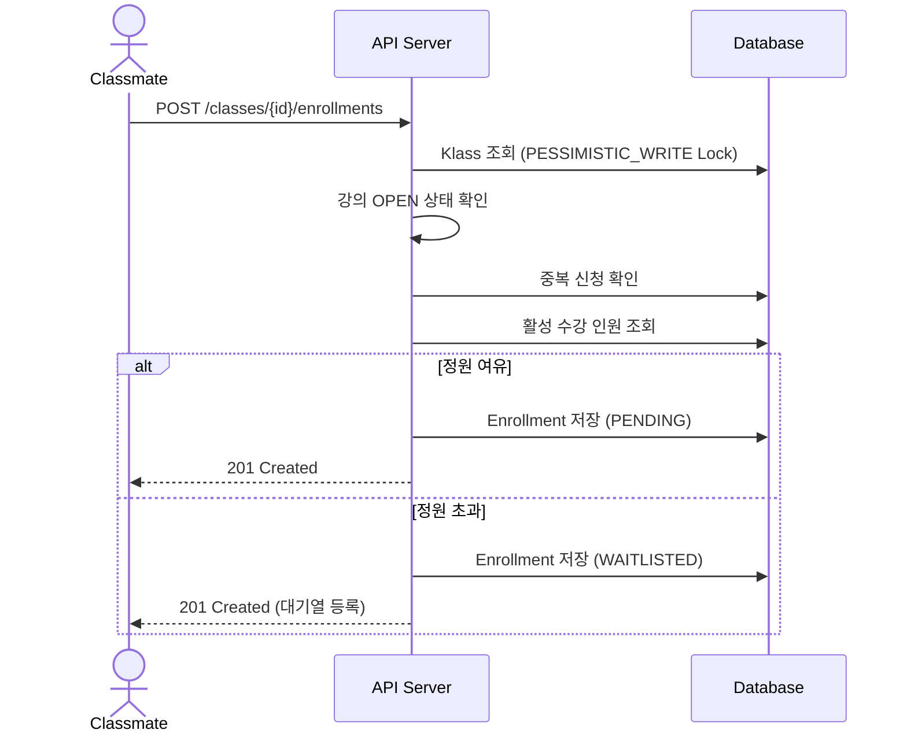
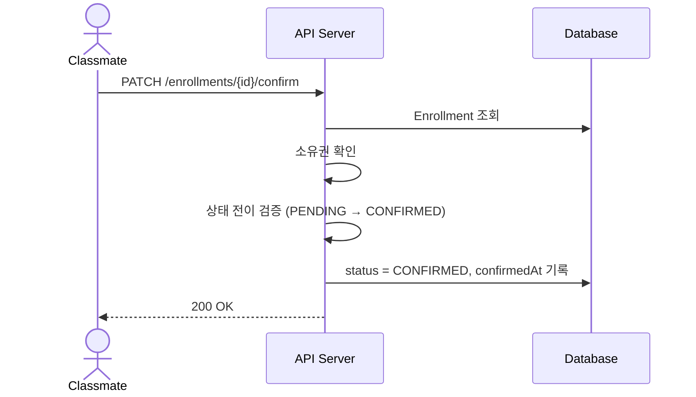
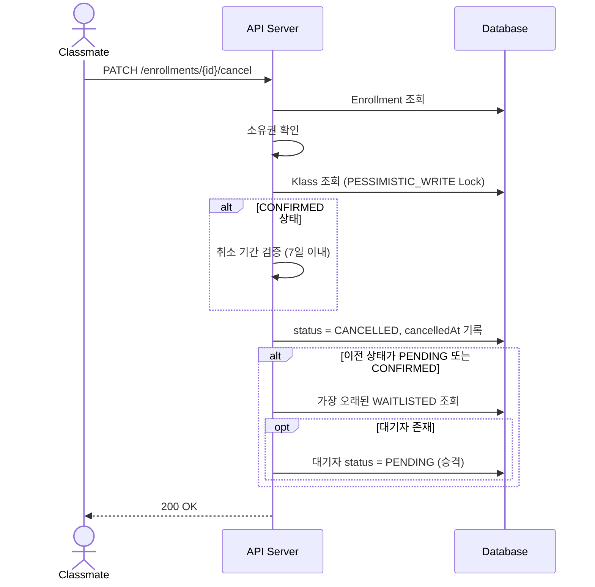
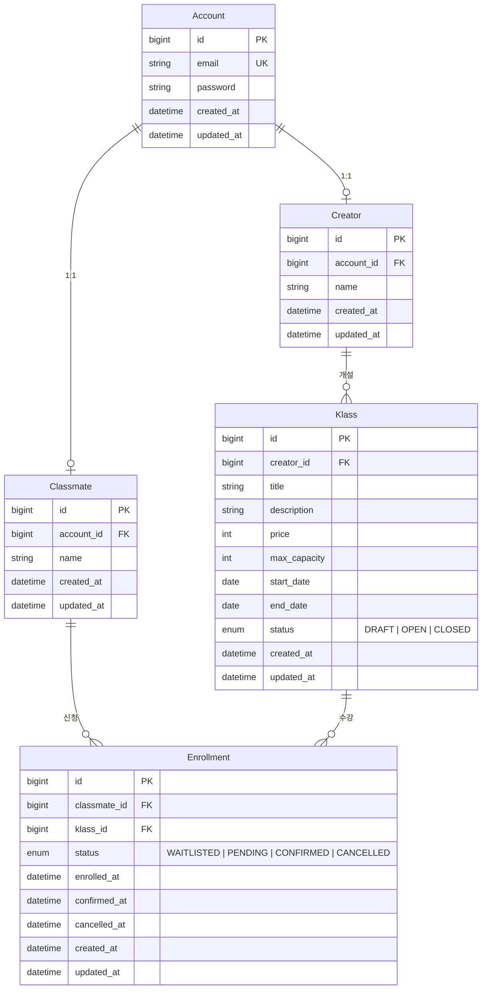

# LiveKlass - 수강 신청 시스템

## 프로젝트 개요

크리에이터(강사)가 강의를 개설하고, 클래스메이트(수강생)가 수강 신청을 하는 시스템입니다.

주요 기능:
- 강의 등록 및 상태 관리 (DRAFT → OPEN → CLOSED)
- 수강 신청, 결제 확정, 취소
- 정원 초과 시 대기열(Waitlist) 자동 등록 및 자동 승격
- 취소 가능 기간 제한 (결제 확정 후 7일 이내)
- 수강 내역 페이지네이션 조회

## 기술 스택

| 구분 | 기술 |
|------|------|
| Language | Java 21 |
| Framework | Spring Boot 4.0.6 |
| ORM | Spring Data JPA (Hibernate) |
| Database | PostgreSQL 16 |
| Authentication | JWT (jjwt 0.13.0) |
| Security | Spring Security |
| Build | Gradle (Groovy DSL) |
| Container | Docker Compose |
| Test | JUnit 5, Mockito, AssertJ |

## 실행 방법

### 사전 준비

- Docker & Docker Compose

### 실행

프로젝트 루트에 `.env` 파일을 생성합니다 (`.env.example` 참고):

```
POSTGRES_DB=testa
POSTGRES_USER=testa
POSTGRES_PASSWORD=testa1234
JWT_SECRET=your-secret-key-must-be-at-least-32-bytes-long
JWT_EXPIRATION_MS=3600000
```

Docker Compose로 전체 스택(PostgreSQL + 애플리케이션)을 실행합니다:

```bash
docker compose up --build -d
```

서버가 `http://localhost:8080/api` 에서 실행됩니다.

### 로컬 개발 (Docker 없이)

Java 21이 필요합니다. PostgreSQL만 Docker로 실행하고 앱은 로컬에서 실행할 수 있습니다:

```bash
docker compose up postgres -d
./gradlew bootRun
```

## 상태 다이어그램

### Class(강의) 상태

강의는 생성 시 `DRAFT` 상태로 시작하며, 단방향으로만 전이된다.

| 상태 | 설명 | 수강 신청 |
|------|------|-----------|
| DRAFT | 초안 — 아직 공개되지 않은 강의 | 불가 |
| OPEN | 모집 중 — 수강 신청 가능 | 가능 |
| CLOSED | 모집 마감 — 더 이상 신청 불가 | 불가 |



### Enrollment(수강 신청) 상태

수강 신청은 정원 여부에 따라 `PENDING` 또는 `WAITLISTED`로 시작한다.
`CANCELLED`는 최종 상태이며, 되돌릴 수 없다.

| 상태 | 설명 |
|------|------|
| PENDING | 신청 완료, 결제 대기 |
| WAITLISTED | 정원 초과로 대기 중 |
| CONFIRMED | 결제 완료, 수강 확정 |
| CANCELLED | 취소됨 (최종 상태) |

**취소 규칙:**
- `PENDING`, `WAITLISTED` → 즉시 취소 가능
- `CONFIRMED` → 결제 확정(`confirmedAt`) 후 **7일 이내**만 취소 가능



## API 흐름 (시퀀스 다이어그램)

### 강의 등록 및 상태 변경



### 수강 신청



### 결제 확정



### 수강 취소 (대기열 자동 승격 포함)



## API 목록 및 예시

### 인증

#### 로그인
```
POST /api/auth/login
```
```json
{
  "email": "creator@test.com",
  "password": "password123"
}
```
응답: Body 없음. `Authorization` 헤더에 `Bearer {token}` 반환.

### 크리에이터 (강사)

#### 회원가입
```
POST /api/creators/sign-up
```
```json
{
  "email": "creator@test.com",
  "password": "password123",
  "name": "강사이름"
}
```
응답: `201 Created`, Body 없음.

#### 강의 등록
```
POST /api/classes
Authorization: Bearer {token}
```
```json
{
  "title": "Spring Boot 강의",
  "description": "Spring Boot 심화 과정",
  "price": 50000,
  "maxCapacity": 30,
  "startDate": "2026-07-01",
  "endDate": "2026-07-31"
}
```
응답: `201 Created`, Body 없음.

#### 강의 상태 변경
```
PATCH /api/classes/{classId}/status
Authorization: Bearer {token}
```
```json
{
  "status": "OPEN"
}
```
응답: `200 OK`, Body 없음.

#### 강의별 수강생 목록 조회 (크리에이터 전용)
```
GET /api/classes/{classId}/enrollments?page=0&size=20
Authorization: Bearer {token}
```
응답:
```json
{
  "content": [
    {
      "enrollmentId": 1,
      "classmateId": 1,
      "classmateName": "수강생이름",
      "status": "CONFIRMED",
      "enrolledAt": "2026-07-01T10:00:00",
      "confirmedAt": "2026-07-01T12:00:00"
    }
  ],
  "totalElements": 1,
  "totalPages": 1,
  "size": 20,
  "number": 0
}
```

### 클래스메이트 (수강생)

#### 회원가입
```
POST /api/classmates/sign-up
```
```json
{
  "email": "student@test.com",
  "password": "password123",
  "name": "수강생이름"
}
```
응답: `201 Created`, Body 없음.

#### 수강 신청
```
POST /api/classes/{classId}/enrollments
Authorization: Bearer {token}
```
응답: `201 Created`, Body 없음. 정원 초과 시 WAITLISTED 상태로 자동 등록.

#### 결제 확정
```
PATCH /api/enrollments/{enrollmentId}/confirm
Authorization: Bearer {token}
```
응답: `200 OK`, Body 없음.

#### 수강 취소
```
PATCH /api/enrollments/{enrollmentId}/cancel
Authorization: Bearer {token}
```
응답: `200 OK`, Body 없음. 대기열이 있으면 자동 승격 처리.

#### 내 수강 신청 목록 조회
```
GET /api/enrollments/me?page=0&size=20
Authorization: Bearer {token}
```
응답:
```json
{
  "content": [
    {
      "id": 1,
      "classId": 1,
      "classTitle": "Spring Boot 강의",
      "status": "CONFIRMED",
      "enrolledAt": "2026-07-01T10:00:00",
      "confirmedAt": "2026-07-01T12:00:00",
      "cancelledAt": null
    }
  ],
  "totalElements": 1,
  "totalPages": 1,
  "size": 20,
  "number": 0
}
```

### 공개 API

#### 강의 목록 조회 (상태 필터 가능)
```
GET /api/classes?status=OPEN
```
응답:
```json
[
  {
    "id": 1,
    "title": "Spring Boot 강의",
    "description": "Spring Boot 심화 과정",
    "price": 50000,
    "maxCapacity": 30,
    "startDate": "2026-07-01",
    "endDate": "2026-07-31",
    "status": "OPEN",
    "creatorName": "강사이름"
  }
]
```

#### 강의 상세 조회
```
GET /api/classes/{classId}
```
응답:
```json
{
  "id": 1,
  "title": "Spring Boot 강의",
  "description": "Spring Boot 심화 과정",
  "price": 50000,
  "maxCapacity": 30,
  "currentEnrollment": 5,
  "startDate": "2026-07-01",
  "endDate": "2026-07-31",
  "status": "OPEN",
  "creatorName": "강사이름"
}
```

## 데이터 모델 설명



- **Account**: 인증 정보 (이메일, 비밀번호). Creator/Classmate와 1:1 관계.
- **Creator**: 강사. 강의를 개설하고 수강생 목록을 조회할 수 있음.
- **Classmate**: 수강생. 강의에 수강 신청, 확정, 취소 가능.
- **Klass**: 강의. `Class`가 Java 예약어이므로 `Klass`로 명명. 상태 머신: DRAFT → OPEN → CLOSED.
- **Enrollment**: 수강 신청. 상태 머신: WAITLISTED → PENDING → CONFIRMED → CANCELLED.

## 요구사항 해석 및 가정

### 해석

1. **결제 확정**: 외부 결제 시스템 연동 없이 단순 상태 변경(`PENDING → CONFIRMED`)으로 대체.
2. **정원 초과 처리**: 정원 초과 시 즉시 거부 대신 **대기열(WAITLISTED)** 상태로 등록. 기존 수강자가 취소하면 대기열에서 가장 먼저 신청한 사람이 자동으로 PENDING 상태로 승격.
3. **취소 가능 기간**: CONFIRMED(결제 확정) 후 **7일 이내**만 취소 가능. PENDING 상태에서는 기간 제한 없이 취소 가능.
4. **동시성 제어**: 마지막 자리에 동시 신청하는 경우를 고려하여 비관적 락(`PESSIMISTIC_WRITE`) 적용.

### 가정

1. Creator와 Classmate는 서로 다른 역할로, 한 Account에 하나의 역할만 가능.
2. 한 수강생은 동일 강의에 활성 상태(WAITLISTED/PENDING/CONFIRMED)의 신청을 하나만 가질 수 있음. 취소 후 재신청은 가능.
3. 강의 상태 전이는 단방향: DRAFT → OPEN → CLOSED. 역방향 전이 불가.
4. 대기열 승격 순서는 `enrolledAt`(신청 시각) 기준 오름차순.

## 동시성 제어 전략

### 문제 상황

인기 강의에 수백 명이 동시에 수강 신청할 때, 정원 확인과 저장 사이에 경쟁 조건(Race Condition)이 발생한다.

**예시** — 정원 30명, 현재 29명인 강의에 A와 B가 동시 신청:
1. A: 현재 인원 조회 → 29명 → 정원 여유 있음
2. B: 현재 인원 조회 → 29명 → 정원 여유 있음
3. A: 저장 → 30명
4. B: 저장 → 31명 (정원 초과)

### 검토한 대안

| 방식 | 동작 원리 | 장점 | 단점 |
|------|----------|------|------|
| **비관적 락** | `SELECT ... FOR UPDATE`로 row 잠금, 트랜잭션 끝까지 보유 | 정합성 확실, 구현 단순 | 동시 요청 시 직렬화로 대기 발생 |
| **낙관적 락** | `@Version` 컬럼으로 충돌 감지, 충돌 시 예외 | 락 대기 없음, 읽기 성능 우수 | 충돌 시 재시도 필요, 인기 강의에서 재시도 폭증 |
| **원자적 UPDATE** | `UPDATE SET count+1 WHERE count < max` 한 줄로 처리 | 락 순간만 발생, 높은 동시성 | 별도 카운트 컬럼 동기화 관리 필요, 정합성 깨질 위험 |
| **Redis 분산 락** | 애플리케이션 레벨에서 분산 락 | DB 부하 분산, 스케일아웃 용이 | 인프라 추가 필요, 단일 서버 규모에 과도 |

### 비관적 락을 선택한 이유

**1. 정합성 최우선 도메인**

수강 신청은 결제와 직결된다. 정원 초과가 발생하면 환불/CS 이슈로 이어지므로,
성능을 일부 희생하더라도 정합성을 보장하는 것이 올바른 선택이다.

**2. 현실적 병목 수준**

한 트랜잭션 처리 시간은 수십 ms 수준이다.
동시 100명이 신청해도 마지막 사람의 대기 시간은 수 초 이내로,
교육 플랫폼 규모에서 실질적인 문제가 되지 않는다.

**3. 별도 동기화 불필요**

매번 enrollment 테이블을 COUNT하여 정원을 확인하므로,
원자적 UPDATE 방식처럼 별도 카운트 컬럼을 관리할 필요가 없다.
데이터 불일치 위험이 원천 차단된다.

**4. 확장 경로 확보**

트래픽이 대규모로 증가하면 원자적 UPDATE나 Redis 분산 락으로 전환할 수 있다.
현재 구조에서 락 획득 지점이 명확하므로 전환 비용도 낮다.

### 적용 범위

| API | 락 적용 | 이유 |
|-----|---------|------|
| 수강 신청 (enroll) | Klass row에 `PESSIMISTIC_WRITE` | 정원 체크 + 저장의 원자성 보장 |
| 수강 취소 (cancel) | Klass row에 `PESSIMISTIC_WRITE` | 취소 + 대기열 승격의 원자성 보장 |
| 결제 확정 (confirm) | 락 없음 | 단일 Enrollment 상태 변경, 정원 영향 없음 |
| 강의 상태 변경 | 락 없음 | Creator 단독 작업, 동시성 이슈 없음 |

## 설계 결정과 이유

### 1. Creator / Classmate 분리 (통합 User 대신)
역할별 도메인 로직과 데이터가 다르므로 별도 엔티티로 분리. Account는 인증만 담당하고, 도메인 행위는 각 역할 엔티티에 위임.

### 2. UseCase 인터페이스 + Service 구현 패턴
Controller가 구체 Service 클래스에 직접 의존하지 않도록 UseCase 인터페이스를 통해 의존성 역전(DIP) 적용. 테스트 시 mock 교체가 용이.

### 3. 비관적 락 (Pessimistic Lock) 선택
상세 근거는 위의 [동시성 제어 전략](#동시성-제어-전략) 참고.

### 4. 도메인 객체 내 상태 전이 검증
`EnrollmentStatus`와 `ClassStatus`가 허용된 전이 목록을 직접 관리. 잘못된 상태 전이 시 도메인 계층에서 즉시 예외 발생.

### 5. @ConfigurationProperties (record) for JWT 설정
`@Value` 대신 `@ConfigurationProperties` record를 사용하여 타입 안전성 확보 및 테스트 용이성 향상.

### 6. 정적 팩토리 메서드 패턴
엔티티 생성 시 `create()` 정적 팩토리 메서드를 사용하여 도메인 검증 로직을 생성 시점에 강제. 유효하지 않은 객체가 존재할 수 없도록 보장.

## 테스트 실행 방법

```bash
./gradlew test
```

### 테스트 구성

| 테스트 | 설명 |
|--------|------|
| `JwtTokenProviderTest` | JWT 토큰 생성, 검증, 파싱 |
| `KlassTest` | 강의 생성 검증, 상태 전이 |
| `EnrollmentStatusTest` | 수강 상태 전이 규칙 |
| `EnrollmentTest` | 수강 신청 생성, 확정, 취소, 소유권 |
| `EnrollmentServiceTest` | 수강 신청 서비스 로직 (Mockito) |

모든 테스트는 **given / when / then** 형식으로 작성되어 있으며, 외부 의존성(DB, 네트워크) 없이 실행됩니다.

## 트러블슈팅

### 수강 취소 시 동시성 문제

**문제**: `enroll`(수강 신청)은 강의에 비관적 락(`PESSIMISTIC_WRITE`)을 잡지만, `cancel`(수강 취소)은 락 없이 대기열 승격을 수행하고 있었다. 정원이 꽉 찬 상태에서 취소와 신규 신청이 동시에 발생하면, 취소로 인한 대기열 승격과 신규 신청의 정원 체크가 서로를 인식하지 못해 정원을 초과할 수 있는 경쟁 조건이 존재했다.

**예시** (정원 1, A=PENDING, B=WAITLISTED):
1. A가 취소 시작 → 락 없이 B를 PENDING으로 승격
2. 동시에 C가 신청 → 강의 락 획득 → B 승격이 아직 커밋 안 됨 → activeCount=0 → PENDING으로 저장
3. 결과: B(PENDING) + C(PENDING) = 정원 초과

**해결**: `cancel`에서도 대기열 승격 전에 `findByIdWithLock`으로 강의에 비관적 락을 잡도록 수정. 취소와 신청이 동일한 락을 경쟁하므로 직렬화가 보장된다.

## 미구현 / 제약사항

- **실제 결제 연동 없음**: 결제 확정은 단순 상태 변경으로 대체.
- **이메일 인증 없음**: 회원가입 시 이메일 유효성만 검증, 실제 발송/확인 없음.
- **강의 수정/삭제 API 없음**: 현재 강의 등록과 상태 변경만 지원.
- **관리자 기능 없음**: 별도 관리자 역할이나 대시보드 없음.
- **통합 테스트 미작성**: 단위 테스트만 존재. 컨트롤러-서비스-DB를 연결한 통합 테스트는 미구현.
- **Refresh Token 미지원**: Access Token만 발급. 토큰 만료 시 재로그인 필요.

## AI 활용 범위


### AI가 한 것
- 도메인 엔티티, 서비스, 컨트롤러 코드 작성
- JWT 인증/인가 구현
- 대기열, 페이지네이션 등 기능 구현
- 단위 테스트 작성
- GitHub 이슈 생성 및 PR 관리
- 코드 리뷰 피드백 반영

### 제가 한 것 
- 요구사항 정의 및 범위 결정
- 설계 방향 결정 (엔티티 분리 전략, 기술 선택 등)
- PR 리뷰 및 머지 승인
- 구현 우선순위 결정
- 최종 검증 및 수동 테스트
