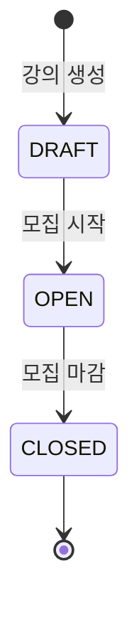
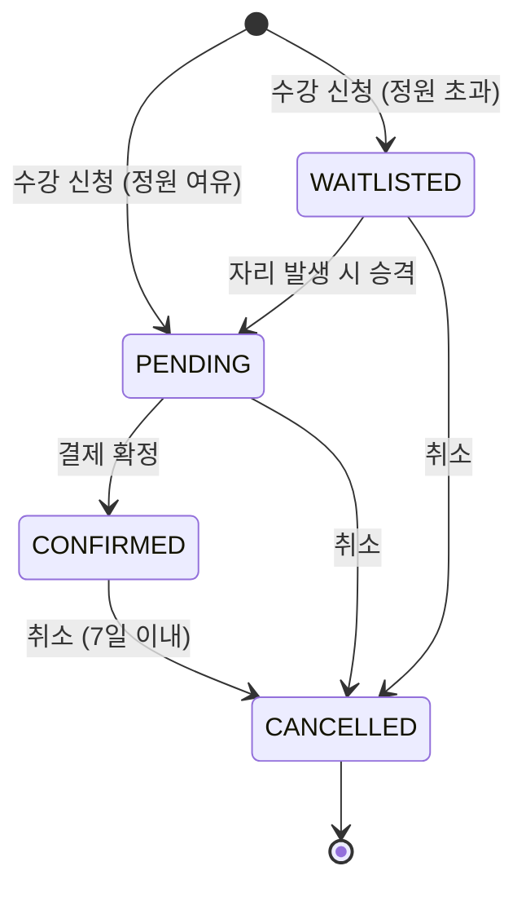

# 상태 다이어그램

## Class(강의) 상태

강의는 생성 시 `DRAFT` 상태로 시작하며, 단방향으로만 전이된다.

| 상태 | 설명 | 수강 신청 |
|------|------|-----------|
| DRAFT | 초안 — 아직 공개되지 않은 강의 | 불가 |
| OPEN | 모집 중 — 수강 신청 가능 | 가능 |
| CLOSED | 모집 마감 — 더 이상 신청 불가 | 불가 |

## Enrollment(수강 신청) 상태

수강 신청은 정원 여부에 따라 `PENDING` 또는 `WAITLISTED`로 시작한다.
`CANCELLED`는 최종 상태이며, 되돌릴 수 없다.

| 상태 | 설명 |
|------|------|
| PENDING | 신청 완료, 결제 대기 |
| WAITLISTED | 정원 초과로 대기 중 |
| CONFIRMED | 결제 완료, 수강 확정 |
| CANCELLED | 취소됨 (최종 상태) |

### 취소 규칙

- `PENDING`, `WAITLISTED` → 즉시 취소 가능
- `CONFIRMED` → 결제 확정(`confirmedAt`) 후 **7일 이내**만 취소 가능

